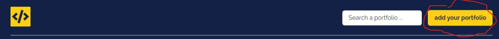
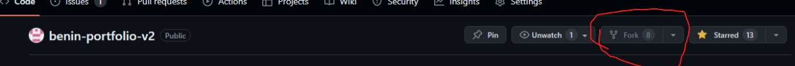

### **Bienvenue dans le portfolio de Benin.**

Pour ajouter votre profil à notre base de données de portfolio, cliquez sur le bouton **add your portfolio** dans la barre de navigation.



Une fois que vous avez cliqué sur le bouton, vous serez redirigé vers le GitHub du projet. Une fois dessus, cliquez sur **Fork** afin de créer une copie du projet chez vous, et surtout n'oubliez pas de mettre une **Star** pour soutenir le projet.

L'avantage ici, c'est que tout le monde peut être contributeur sur le projet.

1. **Fork**



2. **Créez une nouvelle copie du projet sur votre dépôt**
3. **Créez une nouvelle branche (add/your-name)**
4. **Explorez les fichiers et allez dans data/users.ts**

Vous y trouverez un tableau d'objets, voici un exemple d'une entrée du tableau :

```javascript
{
  name: "Gomez Jacob",
  link: "https://www.linkedin.com/in/jacob-ambroise-david-gomez-989b151b9/",
  linkSlug: "jacobgomez.dev",
  tags: [Category.Frontend, Category.Backend, Category.DevOps],
  technology: [FrontendTechnology.HTML, FrontendTechnology.CSS, FrontendTechnology.TailwindCSS, FrontendTechnology.VueJS, FrontendTechnology.NuxtJS, BackendTechnology.NodeJS_AdonisJS, DevOpsTechnology.Docker],
  description: "FullStack JavaScript web developer, working with #vue, #nuxt #js #ts #adonis",
  socials: {
    twitter: "gojanda325",
    github: "jacobGomez325",
    linkedin: "jacob-ambroise-david-gomez-989b151b9",
  },
},
```

Le code est 100% typé, alors nous vous invitons à vous inscrire tout en respectant le format des données.

5. **La clé name**

C'est simplement votre nom, par exemple : John Doe.

6. **La clé link**

C'est le lien que vous souhaitez mettre en avant pour mieux vous vendre. Dans cet exemple, c'est un compte LinkedIn, mais cela pourrait être Twitter ou votre portfolio.

7. **La clé linkSlug**

C'est le nom du lien, un peu comme une balise HTML :

```html
<a href="link"> linkSlug </a>
```

8. **La clé tags**

C'est une partie sensible, veuillez faire attention.

Dans le code, j'ai importé toutes les tags dans le fichier `/data/users.ts` :

```typescript
import { Category } from '~/types/categorie.type'
```

Les tags se trouvent dans le fichier `/types/categorie.types.ts` :

Voici un aperçu du fichier :

```javascript
export enum Category {
  Frontend = "Frontend",
  Backend = "Backend",
  Design = "Design",
  Mobile = "Mobile",
  DevOps = "DevOps",
  Web3 = "Web3",
  Data = "Data",
  SWE = "Software Engineer",
  Cybersecurity = "Cybersecurity"
}
```

N.B. : Vous pouvez également ajouter une catégorie si vous estimez que la vôtre ne se trouve pas dans la liste, mais en respectant le format défini.

9. **L'attribut technology**

Vous devez faire la liste de toutes les technologies que vous utilisez. Suivez simplement l'exemple d'un des éléments du tableau.

Pour vous aider, vous disposez d'une énumération qui liste différentes technologies que vous pouvez déjà utiliser :

```javascript
import {
  FrontendTechnology,
  BackendTechnology,
  DesignTechnology,
  MobileTechnology,
  DevOpsTechnology,
  Web3Technology,
  DataTechnology,
  CybersecurityTechnology
} from '~/types/technologies.type'
```

Pour plus de détails, consultez le fichier `types/technologies.type.ts`.

```typescript
export enum FrontendTechnology {
  ReactJS = "React.js",
  NextJS = "Next.js",
  Angular = "Angular",
  VueJS = "Vue.js",
  NuxtJS = "Nuxt.js",
  CSS = "CSS",
  SASS_LESS = "SASS/LESS",
  TailwindCSS = "Tailwind CSS",
  HTML = "HTML",
  HTMX = "HTMX",
  JSX = "JSX"
}

// Les autres énumérations sont similaires...
```

N.B. : Si les technologies que vous utilisez ne sont pas dans la liste, ajoutez-les en respectant le format et n'hésitez pas à créer une énumération si nécessaire.

10. **L'attribut description**

Décrivez-vous en quelques lignes, cela peut toujours être utile. Vous pouvez copier votre description LinkedIn, GitHub, etc.

11. **L'attribut socials**

```javascript
socials: {
  twitter: "gojanda325",
  github: "jacobGomez325",
  linkedin: "jacob-ambroise-david-gomez-989b151b9",
},
```

Pour l'instant, nous avons seulement 3 réseaux sociaux, mais tout est optionnel. Si vous n'avez que Twitter, renseignez simplement votre identifiant. Si vous n'avez pas de LinkedIn, vous pouvez retirer la clé de l'objet, tout est optionnel.
