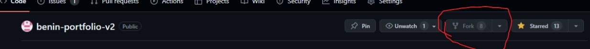

Welcome to the Benin portfolio!

To add your profile to our portfolio database, click on the **add your portfolio** button in the navigation bar.


Once you've clicked the button, you'll be redirected to the project's GitHub page. Once there, click on **Fork** to create a copy of the project on your own account, and don't forget to give it a **Star** to support the project.

The advantage here is that everyone can contribute to the project.

1. **Fork**



2. **Create a new copy of the project on your repository**
3. **Create a new branch (add/your-name)**
4. **Explore the files and go to data/users.ts**

You'll find an array of objects there. Here's an example entry:

```javascript
{
  name: "Gomez Jacob",
  link: "https://www.linkedin.com/in/jacob-ambroise-david-gomez-989b151b9/",
  linkSlug: "jacobgomez.dev",
  tags: [Category.Frontend, Category.Backend, Category.DevOps],
  technology: [FrontendTechnology.HTML, FrontendTechnology.CSS, FrontendTechnology.TailwindCSS, FrontendTechnology.VueJS, FrontendTechnology.NuxtJS, BackendTechnology.NodeJS_AdonisJS, DevOpsTechnology.Docker],
  description: "FullStack JavaScript web developer, working with #vue, #nuxt #js #ts #adonis",
  socials: {
    twitter: "gojanda325",
    github: "jacobGomez325",
    linkedin: "jacob-ambroise-david-gomez-989b151b9",
  },
},
```

The code is 100% type-safe, so we invite you to sign up while respecting the data format.

5. **The name key**

Simply your name, for example: John Doe.

6. **The link key**

This is the link you want to highlight to promote yourself. In this example, it's a LinkedIn account, but it could be Twitter or your portfolio.

7. **The linkSlug key**

This is the name of the link, similar to an HTML tag:

```html
<a href="link"> linkSlug </a>
```

8. **The tags key**

This is a sensitive part, please pay attention.

In the code, I imported all tags in the `/data/users.ts` file:

```typescript
import { Category } from '~/types/categorie.type'
```

The tags are located in the `/types/categorie.types.ts` file:

Here's a preview of the file:

```javascript
export enum Category {
  Frontend = "Frontend",
  Backend = "Backend",
  Design = "Design",
  Mobile = "Mobile",
  DevOps = "DevOps",
  Web3 = "Web3",
  Data = "Data",
  SWE = "Software Engineer",
  Cybersecurity = "Cybersecurity"
}
```

N.B.: You can also add a category if you feel yours is not in the list, but please respect the defined format.

9. **The technology attribute**

List all the technologies you use. Just follow the example of one of the elements in the array.

To help you, there's an enumeration listing different technologies you can already use:

```javascript
import {
  FrontendTechnology,
  BackendTechnology,
  DesignTechnology,
  MobileTechnology,
  DevOpsTechnology,
  Web3Technology,
  DataTechnology,
  CybersecurityTechnology
} from '~/types/technologies.type'
```

For more details, see the `types/technologies.type.ts` file.

```typescript
export enum FrontendTechnology {
  ReactJS = "React.js",
  NextJS = "Next.js",
  Angular = "Angular",
  VueJS = "Vue.js",
  NuxtJS = "Nuxt.js",
  CSS = "CSS",
  SASS_LESS = "SASS/LESS",
  TailwindCSS = "Tailwind CSS",
  HTML = "HTML",
  HTMX = "HTMX",
  JSX = "JSX"
}

// The other enums are similar...
```

N.B.: If the technologies you use are not in the list, add them while respecting the format, and feel free to create an enumeration if necessary.

10. **The description attribute**

Describe yourself in a few lines, it can always be useful. You can copy your LinkedIn, GitHub, etc., description.

11. **The socials attribute**

```javascript
socials: {
  twitter: "gojanda325",
  github: "jacobGomez325",
  linkedin: "jacob-ambroise-david-gomez-989b151b9",
},
```

For now, we only have 3 social networks, but everything is optional. If you only have Twitter, just provide your handle. If you don't have LinkedIn, you can remove the key from the object, everything is optional.

12. **Submit a pull request**

Once the data is added, submit a PR for validation.
